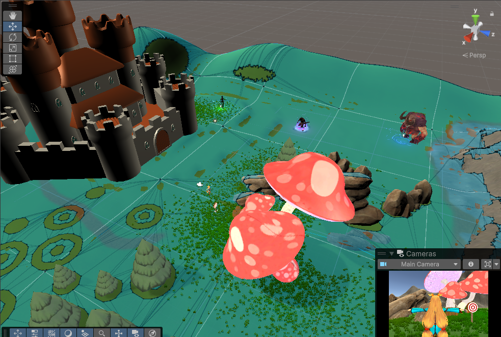
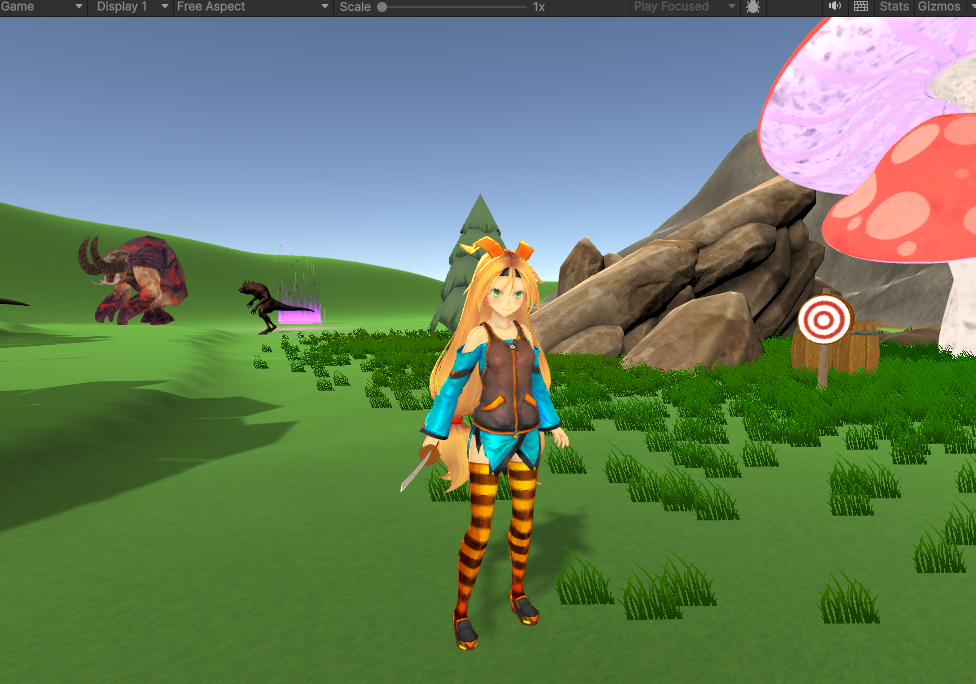
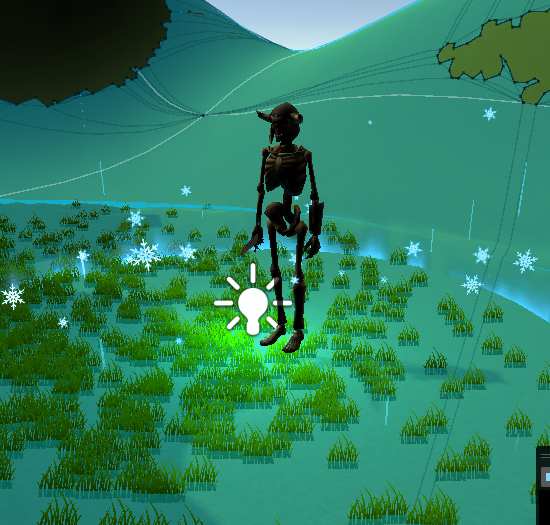
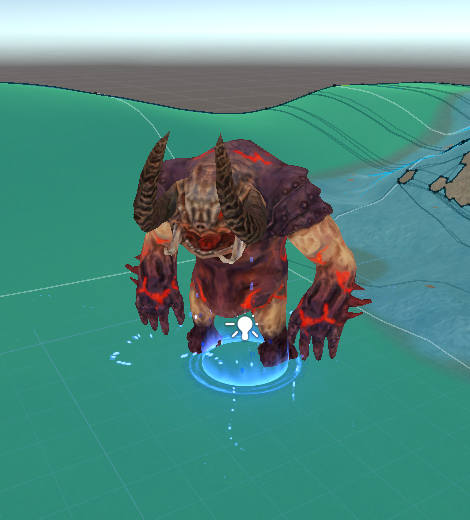
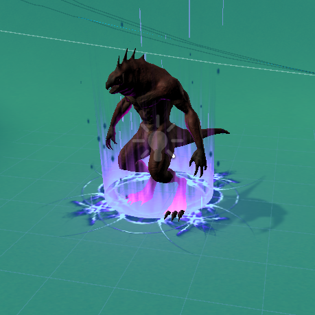

# 🏰 Castle Defender – Proteja a Princesa

## 🎮 Descrição do Jogo e Controles
**Castle Defender** é um jogo em terceira pessoa desenvolvido no Unity, em que o jogador precisa **defender o castelo** contra ondas de monstros que surgem pelo mapa.  
Os inimigos (Esqueleto, Lagarto e Golem) possuem quantidades de vida diferentes, exigindo vários golpes para serem derrotados.

**Controles:**
- **W, A, S, D** → Movimentar o personagem  
- **Mouse** → Girar a câmera  
- **Clique esquerdo do mouse** → Atacar  
- **Espaço** → Pular  
- **Shift (se habilitado)** → Dash / corrida  

---

## 📖 História do Jogo
No reino de **Elyndor**, uma fenda sombria se abriu na floresta, liberando criaturas corrompidas: **esqueletos**, **lagartos demoníacos** e **golems de pedra**.  
A princesa **Aveline** é a guardiã de uma antiga magia capaz de **fechar a fenda**, e por isso os monstros avançam em direção ao castelo.

Seu objetivo é simples e decisivo: **eliminar todos os inimigos antes que eles alcancem o castelo** e garantir a sobrevivência do reino.

---

## 📹 Vídeo do Jogo em Execução (Gameplay)
👉 **[Assista ao gameplay aqui](INSIRA_O_LINK_DO_VÍDEO_AQUI)**  

---

## 📸 Prints do Jogo  

### 🏝️🏰 Mapa
  

### ⚔️ Princesa  
  

### 💀 Inimigos    
  
  
  

---

## 🧾 Tecnologias Utilizadas
- Unity  
- C#  
- Animator Controller  
- Sistema de Física do Unity  

---

## 👤 Desenvolvedor
**Henrique Cursino**  
Projeto desenvolvido para avaliação do 2º bimestre.
